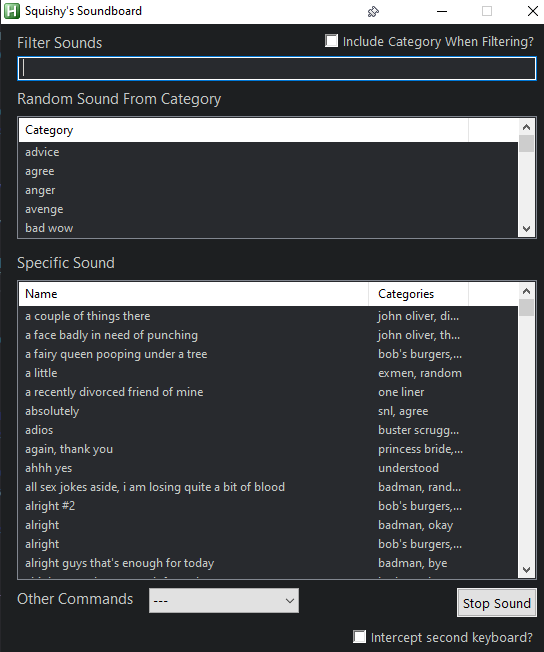

# Squishy's Soundboard

## What is this?
After trying several other soundboard tools available for download, I was never quite satisfied.  

- I wanted a tool that would make it easy to play specific sounds from a library of hundreds of sounds.  
- I wanted the ability to play a random sound from a category, such as a random compliment or hello.
- I wanted to do this without having to bind a series of keybinds or set up a second keyboard.
- I wanted to be able to quickly add and reorganize my sounds without having to update the script itself.

I found a tool by [Asger Juul Brunshøj](https://github.com/plul/Public-AutoHotKey-Scripts) that uses a GUI to allow you to run [AutoHotKey](https://www.autohotkey.com) macros via text commands.  I've adjusted the script quite a bit to fit my needs, and what we have now is Squishy's Soundboard!

## How it works
This repo has a `/sounds` folder with a couple of sounds to get you started.  The script scans filenames in order to generate a list of categories and individual sounds, which are then populated into the interface.

## Using the script
The base requirements to use the script require installation of both [AutoHotKey](https://www.autohotkey.com) and [VLC Media Player](https://www.videolan.org/).  If you want others to hear your sounds when you play them, you will have to configure some additional software.  [I wrote an article detailing how to do this that you should check out!](https://joshpayette.dev/posts/create-your-own-soundboard)

To start using the script, double-click `Soundboard.ahk` in the main folder.  This starts the script, which will listen for you to press `Caps Lock + Spacebar`.  **Note: By default, Caps Lock will not work while the script is working.  You can press `Alt + CapsLock` to toggle it on and off.**

Once you press `Caps Lock + Spacebar`, you should be looking at the soundboard GUI.  If you are not, try the key combo again!

## Using the soundboard GUI
Use the textbox above each list to filter the items in the list.  You can either double-click an item in the list, or press `Enter` in the textbox to play the sound.  **Note: Pressing `Enter` in the textbox only works if there is one item remaining in the list.**

## Adding sounds
When I made this script, I wanted it to be very easy to add and organize your sounds without needing to do anything with the script.  In the project root, there is a sounds folder.  All mp3 files you add to this folder will automatically be brought into the script as soon as they are added.

### Naming the sounds
Your file name should generally follow this structure: `search terms for file [category1, category2].mp3.`  The script will check each file name and take the comma-separated category names from with the `[]` square brackets.  The individual file names list is everything in the file name not enclosed in the square brackets.

I find it works best to use as many of the words from the sound file in the file name, making it easy to filter down and get to the exact file you want.  You can add as many categories as you want, allowing this file to be included if you randomly play a certain category.

### Creating sounds
If you are looking to rip your own sounds from videos or other sound sources, you will want to [check out this article I wrote](https://joshpayette.dev/posts/create-your-own-soundboard) on setting up a virtual audio cable to play the sounds through your mic input, as well as tools to equalize the volume of the sounds and rip your own.
